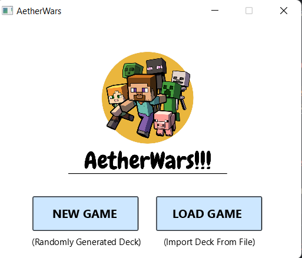
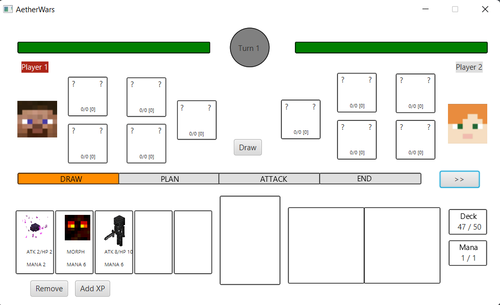
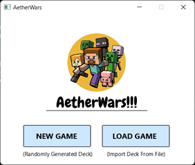
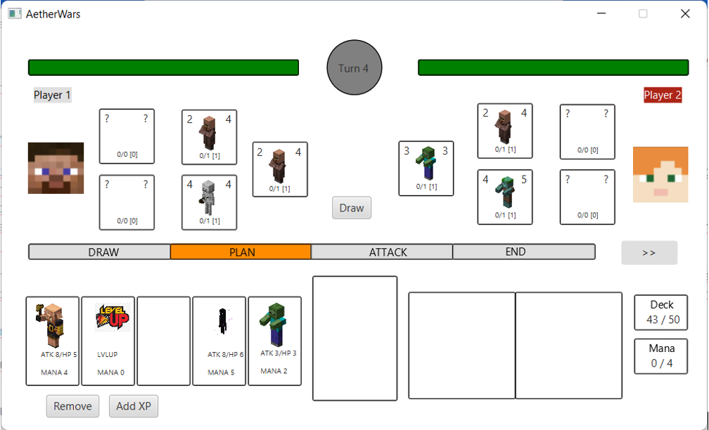
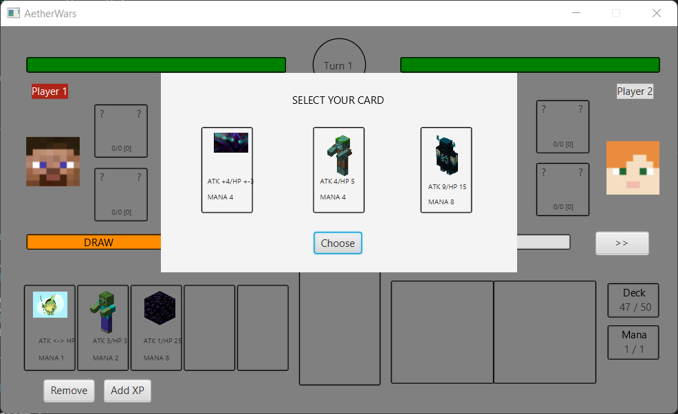

# AetherWars

AetherWars is a GUI-based game made to fulfill our uni Object Oriented Programming course project. This is a turn based card game for 2 players. Players will play alternately on the same screen until the final goal of the game is reached. The goal of the game is to attack the health points (HP) of the enemy until it reaches 0. Please be aware that you may lose when your deck is empty.

<!---
Ini diisi foto-foto ssan
-->
  
  

## Creator

| |
| ---  |
|Gagas Praharsa Bahar  |
|Ubaidillah Ariq Pratama |
|Saul Sayers |
|Patrick Amadeus Irawan |
|Nelsen Putra |
|Rania Dwi Fadhilah |

## How to Use

### Dependencies

- Java 8
- Gradle
- JavaFX

### Installation

```bash
git clone https://github.com/gagaspbahar/turn-based-minecraft.git
```

### Running the Game

Open the terminal from the root directory of the project and type
`./gradlew run`

### Code Structure

```│   .gitignore
│   build.gradle
│   gradlew
│   gradlew.bat
│   README.md
│   settings.gradle
│
├───bin
│   └───main
├───gradle
│   └───wrapper
│           gradle-wrapper.jar
│           gradle-wrapper.properties
│
└───src
    ├───main
    │   ├───java
    │   │   └───com
    │   │       └───aetherwars
    │   │           │   AetherWars.java
    │   │           │   Controller.java
    │   │           │   Controller2.java
    │   │           │   Controller3.java
    │   │           │   Controller4.java
    │   │           │   Controller5.java
    │   │           │   Controller6.java
    │   │           │   GUI.java
    │   │           │
    │   │           ├───model
    │   │           │   │   Card.java
    │   │           │   │   Character.java
    │   │           │   │   Player.java
    │   │           │   │   Spell.java
    │   │           │   │
    │   │           │   └───type
    │   │           │           CardType.java
    │   │           │           CharType.java
    │   │           │           PhaseType.java
    │   │           │           SpellType.java
    │   │           │
    │   │           └───util
    │   │               │   Config.java
    │   │               │
    │   │               └───config
    │   │                       BaseConfig.java
    │   │                       CharacterConfig.java
    │   │                       CSVReader.java
    │   │                       HealSpellConfig.java
    │   │                       LevelSpellConfig.java
    │   │                       ManaConfig.java
    │   │                       MorphSpellConfig.java
    │   │                       PotionSpellConfig.java
    │   │                       SwapSpellConfig.java
    │   │
    │   └───resources
    │       │   Draw3cards.fxml
    │       │   EndGame.fxml
    │       │   ImportDeck.fxml
    │       │   Opening.fxml
    │       │   Sample.fxml
    │       │   ThrowCards.fxml
    │       │
    │       └───com
    │           └───aetherwars
    │               ├───card
    │               │   ├───data
    │               │   │       character.csv
    │               │   │       spell_heal.csv
    │               │   │       spell_level.csv
    │               │   │       spell_morph.csv
    │               │   │       spell_ptn.csv
    │               │   │       spell_swap.csv
    │               │   │
    │               │   └───image
    │               │       ├───character
    │               │       │       base.png
    │               │       │       Creeper.png
    │               │       │       Drowned.png
    │               │       │       Ender Dragon.png
    │               │       │       Enderman.png
    │               │       │       Endermite.png
    │               │       │       Ghast.png
    │               │       │       Magma Cube.png
    │               │       │       mascot1.png
    │               │       │       mascot2.png
    │               │       │       Obsidian.png
    │               │       │       Piglin Brute.png
    │               │       │       question_mark.png
    │               │       │       Sheep.png
    │               │       │       Shulker.png
    │               │       │       Skeleton.png
    │               │       │       Slime.png
    │               │       │       Villager.png
    │               │       │       Warden.png
    │               │       │       white.jpg
    │               │       │       Wither Skeleton.png
    │               │       │       Wither.png
    │               │       │       Zombie.png
    │               │       │
    │               │       └───spell
    │               │           ├───heal
    │               │           │       gebetan.png
    │               │           │       greenherbs.jpg
    │               │           │       indomigoreng.png
    │               │           │
    │               │           ├───level
    │               │           │       leveldown.jpg
    │               │           │       levelup.png
    │               │           │
    │               │           ├───morph
    │               │           │       Creeper... Aw Man.png
    │               │           │       Crybaby Dominion.png
    │               │           │       Drowning.png
    │               │           │       Malin Kundang.png
    │               │           │       Sheepify.png
    │               │           │       Sugondese.png
    │               │           │
    │               │           ├───potion
    │               │           │       Aromatic Ginger Rice.png
    │               │           │       Bad Alcohol.png
    │               │           │       Contract of Living Space.png
    │               │           │       Deathly Magic.png
    │               │           │       Divine Wind.png
    │               │           │       GPU Very Good.png
    │               │           │       Grabkeun.png
    │               │           │       Halal Porkchop.png
    │               │           │       Herobrine's Blessing.png
    │               │           │       Honey Bottle.png
    │               │           │       Kordas' Curse.png
    │               │           │       Mother's Prayer.png
    │               │           │       Sadikin Elixir.png
    │               │           │       SNMPTN Acceptance Letter.png
    │               │           │       SNMPTN Rejection Letter.png
    │               │           │       Spectral Power.png
    │               │           │       Witch's Eye.png
    │               │           │       Yoasobi.png
    │               │           │
    │               │           └───swap
    │               │                   Axolotl Blood.png
    │               │                   Bone Marrow.png
    │               │                   Cat Food.png
    │               │                   Cooked Beef Juice.png
    │               │                   Detergent.png
    │               │                   Ghast Tears.png
    │               │                   Morning's Blessing.png
    │               │                   Potion of Bargaining.png
    │               │                   Potion of Turtle Master.png
    │               │                   Swab Test.png
    │               │
    │               ├───deck
    │               │       1 card.txt
    │               │       10 cards.csv
    │               │       2 cards.txt
    │               │       20 cards.txt
    │               │       3 cards.txt
    │               │       35 cards.csv
    │               │       4 cards.txt
    │               │       45 cards.txt
    │               │       5 cards.txt
    │               │       50 cards.txt
    │               │       6 cards.txt
    │               │       deckFromCSV.csv
    │               │       deckFromTXT.txt
    │               │
    │               └───logo
    │                       AetherWars.png
    │                       GWS.jpeg
    │
    └───test
        └───java
            └───com
                └───aetherwars
                        CardTest.java
                        CharacterTest.java
                        ConfigTest.java
                        PlayerTest.java
                        SpellTest.java
```

## Screenshots





## Credit

Minecraft images and description are taken from [Minecraft Wikia](https://minecraft.fandom.com/wiki/)
Other sources for "random" images are:

- Album Supporteran STEI 2018 :D
- https://mobile.twitter.com/masterlimbad6
- https://www.nationalgeographic.com/science/article/141104-kamikaze-kublai-khan-winds-typhoon-japan-invasion
- https://open.spotify.com/album/3GzwPyPZCyrqUTaurTaS23
- https://cdn.wccftech.com/wp-content/uploads/2021/06/nvidia-geforce-rtx-3080-ti-product-gallery-photo-003-scaled.jpg
- https://twitter.com/GGumiliar
- https://dota2.fandom.com/wiki/Spectre
